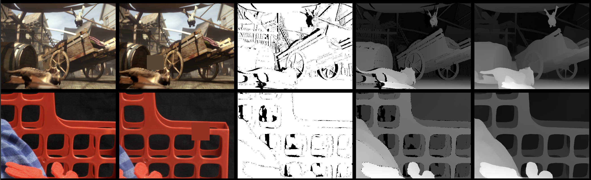
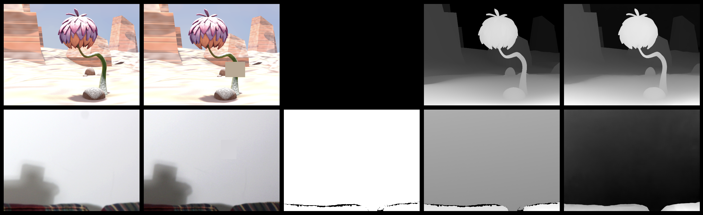
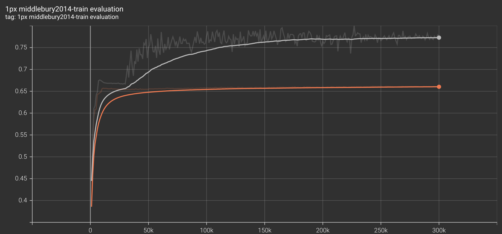
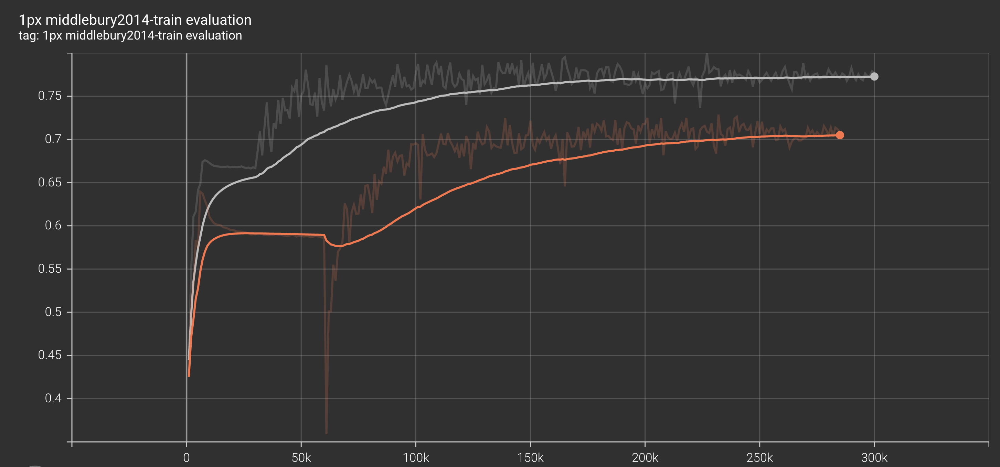

# Stereo Matching reference training scripts

This folder contains reference training scripts for Stereo Matching.
They serve as a log of how to train specific models, so as to provide baseline
training and evaluation scripts to quickly bootstrap research.


### CREStereo

The CREStereo model was trained on a dataset mixture between **CREStereo**, **ETH3D** and the additional split from **Middlebury2014**.
A ratio of **88-6-6** was used in order to train a baseline weight set. We provide multi-set variant as well.
Both used 8 A100 GPUs and a batch size of 2 (so effective batch size is 16). The
rest of the hyper-parameters loosely follow the recipe from https://github.com/megvii-research/CREStereo.
The original recipe trains for **300000** updates (or steps) on the dataset mixture. We modify the learning rate
schedule to one that starts decaying the weight much sooner. Throughout the experiments we found that this reduces 
overfitting during evaluation time and gradient clip help stabilize the loss during a pre-mature learning rate change.

```
torchrun --nproc_per_node 8 --nnodes 1 train.py \
    --dataset-root $dataset_root \
    --name $name_cre \
    --model crestereo_base \
    --train-datasets crestereo eth3d-train middlebury2014-other \
    --dataset-steps 264000 18000 18000
    --batch-size 2 \
    --lr 0.0004 \
    --min-lr 0.00002 \
    --lr-decay-method cosine \
    --warmup-steps 6000 \
    --decay-after-steps 30000 \
    --clip-grad-norm 1.0 \
```

We employ a multi-set fine-tuning stage where we uniformly sample from multiple datasets. Given hat some of these datasets have extremely large images (``2048x2048`` or more) we opt for a very aggressive scale-range ``[0.2 - 0.8]`` such that as much of the original frame composition is captured inside the ``384x512`` crop.

```
torchrun --nproc_per_node 8 --nnodes 1 train.py \
    --dataset-root $dataset_root \
    --name $name_things \
    --model crestereo_base \
    --train-datasets crestereo eth3d-train middlebury2014-other instereo2k fallingthings carla-highres sintel sceneflow-monkaa sceneflow-driving \
    --dataset-steps 12000 12000 12000 12000 12000 12000 12000 12000 12000
    --batch-size 2 \
    --scale-range 0.2 0.8 \
    --lr 0.0004 \
    --lr-decay-method cosine \
    --decay-after-steps 0 \
    --warmup-steps 0 \
    --min-lr 0.00002 \
    --resume-path $checkpoint_dir/$name_cre.pth
```


### Evaluation

Evaluating the base weights

```
torchrun --nproc_per_node 1 --nnodes 1 cascade_evaluation.py --dataset middlebury2014-train --batch-size 1 --dataset-root $dataset_root --model crestereo_base --weights CREStereo_Base_Weights.CRESTEREO_ETH_MBL_V1
```

This should give an **mae of about 1.416** on the train set of `Middlebury2014`. Results may vary slightly depending on the batch size and the number of GPUs. For the most accurate results use 1 GPU and `--batch-size 1`. The created log file should look like this, where the first key is the number of cascades and the nested key is the number of recursive iterations:

```
Dataset: middlebury2014-train @size: [384, 512]:
{
	1: {
		2: {'mae': 2.363, 'rmse': 4.352, '1px': 0.611, '3px': 0.828, '5px': 0.891, 'relepe': 0.176, 'fl-all': 64.511}
		5: {'mae': 1.618, 'rmse': 3.71, '1px': 0.761, '3px': 0.879, '5px': 0.918, 'relepe': 0.154, 'fl-all': 77.128}
		10: {'mae': 1.416, 'rmse': 3.53, '1px': 0.777, '3px': 0.896, '5px': 0.933, 'relepe': 0.148, 'fl-all': 78.388}
		20: {'mae': 1.448, 'rmse': 3.583, '1px': 0.771, '3px': 0.893, '5px': 0.931, 'relepe': 0.145, 'fl-all': 77.7}
	},
}
{
	2: {
		2: {'mae': 1.972, 'rmse': 4.125, '1px': 0.73, '3px': 0.865, '5px': 0.908, 'relepe': 0.169, 'fl-all': 74.396}
		5: {'mae': 1.403, 'rmse': 3.448, '1px': 0.793, '3px': 0.905, '5px': 0.937, 'relepe': 0.151, 'fl-all': 80.186}
		10: {'mae': 1.312, 'rmse': 3.368, '1px': 0.799, '3px': 0.912, '5px': 0.943, 'relepe': 0.148, 'fl-all': 80.379}
		20: {'mae': 1.376, 'rmse': 3.542, '1px': 0.796, '3px': 0.91, '5px': 0.942, 'relepe': 0.149, 'fl-all': 80.054}
	},
}
```

You can also evaluate the Finetuned weights:

```
torchrun --nproc_per_node 1 --nnodes 1 cascade_evaluation.py --dataset middlebury2014-train --batch-size 1 --dataset-root $dataset_root --model crestereo_base --weights CREStereo_Base_Weights.CRESTEREO_FINETUNE_MULTI_V1
```

```
Dataset: middlebury2014-train @size: [384, 512]:
{
	1: {
		2: {'mae': 1.85, 'rmse': 3.797, '1px': 0.673, '3px': 0.862, '5px': 0.917, 'relepe': 0.171, 'fl-all': 69.736}
		5: {'mae': 1.111, 'rmse': 3.166, '1px': 0.838, '3px': 0.93, '5px': 0.957, 'relepe': 0.134, 'fl-all': 84.596}
		10: {'mae': 1.02, 'rmse': 3.073, '1px': 0.854, '3px': 0.938, '5px': 0.96, 'relepe': 0.129, 'fl-all': 86.042}
		20: {'mae': 0.993, 'rmse': 3.059, '1px': 0.855, '3px': 0.942, '5px': 0.967, 'relepe': 0.126, 'fl-all': 85.784}
	},
}
{
	2: {
		2: {'mae': 1.667, 'rmse': 3.867, '1px': 0.78, '3px': 0.891, '5px': 0.922, 'relepe': 0.165, 'fl-all': 78.89}
		5: {'mae': 1.158, 'rmse': 3.278, '1px': 0.843, '3px': 0.926, '5px': 0.955, 'relepe': 0.135, 'fl-all': 84.556}
		10: {'mae': 1.046, 'rmse': 3.13, '1px': 0.85, '3px': 0.934, '5px': 0.96, 'relepe': 0.13, 'fl-all': 85.464}
		20: {'mae': 1.021, 'rmse': 3.102, '1px': 0.85, '3px': 0.935, '5px': 0.963, 'relepe': 0.129, 'fl-all': 85.417}
	},
}
```

Evaluating the author provided weights:

```
torchrun --nproc_per_node 1 --nnodes 1 cascade_evaluation.py --dataset middlebury2014-train --batch-size 1 --dataset-root $dataset_root --model crestereo_base --weights CREStereo_Base_Weights.MEGVII_V1
```

```
Dataset: middlebury2014-train @size: [384, 512]:
{
	1: {
		2: {'mae': 1.704, 'rmse': 3.738, '1px': 0.738, '3px': 0.896, '5px': 0.933, 'relepe': 0.157, 'fl-all': 76.464}
		5: {'mae': 0.956, 'rmse': 2.963, '1px': 0.88, '3px': 0.948, '5px': 0.965, 'relepe': 0.124, 'fl-all': 88.186}
		10: {'mae': 0.792, 'rmse': 2.765, '1px': 0.905, '3px': 0.958, '5px': 0.97, 'relepe': 0.114, 'fl-all': 90.429}
		20: {'mae': 0.749, 'rmse': 2.706, '1px': 0.907, '3px': 0.961, '5px': 0.972, 'relepe': 0.113, 'fl-all': 90.807}
	},
}
{
	2: {
		2: {'mae': 1.702, 'rmse': 3.784, '1px': 0.784, '3px': 0.894, '5px': 0.924, 'relepe': 0.172, 'fl-all': 80.313}
		5: {'mae': 0.932, 'rmse': 2.907, '1px': 0.877, '3px': 0.944, '5px': 0.963, 'relepe': 0.125, 'fl-all': 87.979}
		10: {'mae': 0.773, 'rmse': 2.768, '1px': 0.901, '3px': 0.958, '5px': 0.972, 'relepe': 0.117, 'fl-all': 90.43}
		20: {'mae': 0.854, 'rmse': 2.971, '1px': 0.9, '3px': 0.957, '5px': 0.97, 'relepe': 0.122, 'fl-all': 90.269}
	},
}
```

# Concerns when training

We encourage users to be aware of the **aspect-ratio** and **disparity scale** they are targeting when doing any sort of training or fine-tuning. The model is highly sensitive to these two factors, as a consequence of naive multi-set fine-tuning one can achieve `0.2 mae` relatively fast. We recommend that users pay close attention to how they **balance dataset sizing** when training such networks.

 Ideally, dataset scaling should be trated at an individual level and a thorough **EDA** of the disparity distribution in random crops at the desired training / inference size should be performed prior to any large compute investments.

### Disparity scaling

##### Sample A
 The top row contains a sample from `Sintel` whereas the bottom row one from `Middlebury`.



From left to right (`left_image`, `right_image`, `valid_mask`, `valid_mask & ground_truth`, `prediction`). **Darker is further away, lighter is closer**. In the case of `Sintel` which is more closely aligned to the original distribution of `CREStereo` we notice that the model accurately predicts the background scale whereas in the case of `Middlebury2014` it cannot correctly estimate the continuous disparity. Notice that the frame composition is similar for both examples. The blue skybox in the `Sintel` scene behaves similarly to the `Middlebury` black background. However, because the `Middlebury` samples comes from an extremely large scene the crop size of `384x512` does not correctly capture the general training distribution.


##### Sample B

The top row contains a scene from `Sceneflow` using the `Monkaa` split whilst the bottom row is a scene from `Middlebury`. This sample exhibits the same issues when it comes to **background estimation**. Given the exaggerated size of the `Middlebury` samples the model **colapses the smooth background** of the sample to what it considers to be a mean background disparity value.




For more detail on why this behaviour occurs based on the training distribution proportions you can read more about the network at: https://github.com/pytorch/vision/pull/6629#discussion_r978160493


### Metric overfitting

##### Learning is critical in the beginning

We also advise users to make user of faster training schedules, as the performance gain over long periods time is marginal. Here we exhibit a difference between a faster decay schedule and later decay schedule.



In **grey** we set the lr decay to begin after `30000` steps whilst in **orange** we opt for a very late learning rate decay at around `180000` steps. Although exhibiting stronger variance, we can notice that unfreezing the learning rate earlier whilst employing `gradient-norm` out-performs the default configuration.

##### Gradient norm saves time



In **grey** we keep ``gradient norm`` enabled whilst in **orange** we do not. We can notice that remvoing the gradient norm exacerbates the performance decrease in the early stages whilst also showcasing an almost complete collapse around the `60000` steps mark where we started decaying the lr for **orange**.

Although both runs ahieve an improvement of about ``0.1`` mae after the lr decay start, the benefits of it are observable much faster when ``gradient norm`` is employed as the recovery period is no longer accounted for.
